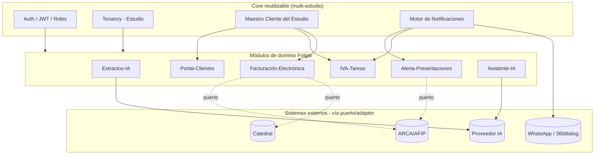

# CLAUDE.md — Nadia.Folgar.Plataforma.Backend

## Reglas para Claude — Ahorra Tokens

### 1. No programar sin contexto
- ANTES de escribir codigo: lee los archivos relevantes, revisa git log, entiende la arquitectura.
- Si no tienes contexto suficiente, pregunta. No asumas.

### 2. Respuestas cortas
- Responde en 1-3 oraciones. Sin preambulos, sin resumen final.
- No repitas lo que el usuario dijo. No expliques lo obvio.
- Codigo habla por si mismo: no narres cada linea que escribes.

### 3. No reescribir archivos completos
- Usa Edit (reemplazo parcial), NUNCA Write para archivos existentes salvo que el cambio sea >80% del archivo.
- Cambia solo lo necesario. No "limpies" codigo alrededor del cambio.

### 4. No releer archivos ya leidos
- Si ya leiste un archivo en esta conversacion, no lo vuelvas a leer salvo que haya cambiado.
- Toma notas mentales de lo importante en tu primera lectura.

### 5. Validar antes de declarar hecho
- Despues de un cambio: compila, corre tests, o verifica que funciona.
- Nunca digas "listo" sin evidencia de que funciona.

### 6. Cero charla aduladora
- No digas "Excelente pregunta", "Gran idea", "Perfecto", etc.
- No halagues al usuario. Ve directo al trabajo.

### 7. Soluciones simples
- Implementa lo minimo que resuelve el problema. Nada mas.
- No agregues abstracciones, helpers, tipos, validaciones, ni features que no se pidieron.
- 3 lineas repetidas > 1 abstraccion prematura.

### 8. No pelear con el usuario
- Si el usuario dice "hazlo asi", hazlo asi. No debatas salvo riesgo real de seguridad o perdida de datos.
- Si discrepas, menciona tu concern en 1 oracion y procede con lo que pidio.

### 9. Leer solo lo necesario
- No leas archivos completos si solo necesitas una seccion. Usa offset y limit.
- Si sabes la ruta exacta, usa Read directo. No hagas Glob + Grep + Read cuando Read basta.

### 10. No narrar el plan antes de ejecutar
- No digas "Voy a leer el archivo, luego modificar la funcion, luego compilar...". Solo hazlo.
- El usuario ve tus tool calls. No necesita un preview en texto.

### 11. Paralelizar tool calls
- Si necesitas leer 3 archivos independientes, lee los 3 en un solo mensaje, no uno por uno.
- Menos roundtrips = menos tokens de contexto acumulado.

### 12. No duplicar codigo en la respuesta
- Si ya editaste un archivo, no copies el resultado en tu respuesta. El usuario lo ve en el diff.
- Si creaste un archivo, no lo muestres entero en texto tambien.

### 13. No usar Agent cuando Grep/Read basta
- Agent duplica todo el contexto en un subproceso. Solo usalo para busquedas amplias o tareas complejas.
- Para buscar una funcion o archivo especifico, usa Grep o Glob directo.

## Qué es esto
Backend de la plataforma operativa para el Estudio Contable Nadia Folgar (Buenos Aires),
construido por Novaptix bajo la metodología "Potencia Operativa" (ciclo de 6 meses,
2026-08-01 a 2027-01-31). Automatiza procesos hoy manuales (extractos bancarios,
vencimientos, facturación de honorarios) y expone la API que consume el Frontend.

## Repo hermano
Frontend en `C:\sources\Nadia.Folgar.Plataforma.Frontend`. Consume esta API vía el
spec de OpenAPI publicado en `/api/docs` (Swagger UI) y `/api/docs-json`. Ese spec es
el contrato formal — si el Frontend necesita algo que no existe acá, se documenta como
pendiente en su propio CLAUDE.md, nunca se inventa la forma de una respuesta.

## Arquitectura

## Mapa de módulos
| Módulo (backlog) | Tareas | Carpeta Backend | Estado |
|---|---|---|---|
| Fundación Técnica | 001–006 | auth/, roles/, users/, clientes/ | **Completo** — auth JWT+refresh, login social OAuth por Google/LinkedIn/Apple (`GET /auth/:provider` + `/callback`, emite los mismos tokens y sólo permite usuarios activos ya existentes por email), permisos granulares, maestro Cliente con paginación, seed inicial. Sumado fuera de backlog (pedido directo de la pantalla "Mi perfil" del Frontend): autogestión del propio usuario — `GET/PATCH /auth/me/profile` (nombre, email, fecha de nacimiento, país/provincia/ciudad, teléfono y género), `PATCH /auth/me/password` (verifica la actual con argon2) y `PUT /auth/me/avatar` (foto como base64 en Mongo, mismo patrón temporal que `Documento` en portal-clientes — ver la nota en `user.schema.ts`). Sumado también fuera de backlog (pantalla "Personal" del Frontend, `features/personal/`): `User` gana `regimenFiscal` (mismo enum que `Cliente.regimenFiscal` — buena parte del equipo del Estudio son monotributistas/responsables inscriptos independientes, no en relación de dependencia) y `CreateUserDto`/`UpdateUserDto` ganan `telefono`/`regimenFiscal` gestionables por un admin vía `POST`/`PATCH /users` (antes `telefono` solo se autogestionaba desde "Mi perfil"). `Cliente` gana `responsableIds?: ObjectId[]` (ref `User`) — a quiénes de "Personal" está asignado ese cliente (**array desde el 26-08-2026**, ver más abajo; antes `responsableId`, campo simple), poblado con nombre/email en `GET /clientes`; `PATCH /clientes/:id` acepta cualquier array (`[]` para vaciar la asignación, `undefined`/campo ausente = no tocarla). Distinto del campo `responsable` (texto libre, sin usar todavía por ningún flujo — cabo suelto de un intento anterior, se dejó como estaba a pedido explícito del usuario). **Actualización (26-08-2026)**: `responsableId` (un solo `ObjectId`) pasó a `responsableIds` (array) — pedido explícito del usuario: un cliente puede tener más de un integrante de Personal a cargo a la vez (ej. Daiana Gencarelli + Nadia Folgar en simultáneo). `CreateClienteDto`/`UpdateClienteDto` cambian `@IsMongoId() responsableId?: string` por `@IsArray() @IsMongoId({ each: true }) responsableIds?: string[]` — ya no hace falta el caso especial de `null` que tenía `UpdateClienteDto` (redeclarado aparte de `CreateClienteDto` para aceptarlo): `[]` ya es un valor de array normal y válido, "vaciar la asignación" no necesita nada extra. Además, `ClientesService` ahora agrega `responsablesEfectivos` a cada cliente devuelto por `GET /clientes`/`GET /clientes/:id` — **calculado en cada request, no persistido**: SOLO quien tenga `User.esTitular: true` (hoy únicamente Nadia Folgar). **Ojo, corrección posterior**: la primera versión de esto unía `responsableIds` (poblado) con el/los titular/es en un mismo array con dedup — el usuario aclaró después que son dos conceptos separados que NO deben mezclarse ("en responsable solo debe estar Nadia Folgar, personal a cargo es otra cosa"): `responsablesEfectivos` no incluye nunca a quien esté en `responsableIds` salvo que esa misma persona sea además titular (`attachResponsablesEfectivos` ya no arma una unión, devuelve directamente la lista de titulares tal cual). Para esto, `ClientesModule` importa también el schema de `User` (mismo patrón que ya usa `IvaTareasModule`). **Primer intento (revertido) y por qué**: la primera versión de esta regla sumaba a "cualquier usuario con rol admin", no a un campo aparte — pero el estudio tiene una cuenta de admin de desarrollo/pruebas ("Yami", `admin@folgar.com.ar`, el seed la crea como "Administrador Folgar" pero fue renombrada a mano) que **no** debe figurar como responsable de nada, aunque conserve permisos de administrador para poder seguir usándola en pruebas. Por eso `User` suma un campo nuevo, `esTitular?: boolean` (default `false`), desacoplado del rol — `ClientesService.findResponsablesAutomaticos()` filtra por `esTitular: true`, no por rol, y ya no depende de `roles/` en absoluto (se sacó `Role`/`RoleSchema` de `ClientesModule`/`ClientesService`). Se marcó a mano contra la base real: `esTitular: true` solo para Nadia Folgar, `false` para el resto (Yami incluida) — sin selector en el Frontend todavía, se tilda directo en Mongo si hace falta sumar otro titular. **Bug de datos real encontrado y corregido de paso** (durante el primer intento, antes de cambiar a `esTitular`): 4 de los 5 usuarios de Personal (todos menos "Yami") tenían `User.roleIds` guardado como *string* en Mongo en vez de `ObjectId` — quedó así de la migración a mano de integrantes/clientes documentada más abajo, que no pasó por el `Model` de Mongoose (que castea automáticamente strings de ObjectId válidos al crear/guardar por ese camino). `.populate('roleIds')` lo disimulaba (Mongoose castea el valor de la query al popular, no lo guardado), así que el login y "Mi perfil" seguían andando bien, pero cualquier query directa por `roleIds` no matcheaba nada — se corrigió a mano contra la base real, casteando esos 4 usuarios a `ObjectId`. Sigue siendo un dato correcto tenerlo así aunque la regla ya no dependa del rol para esto. **Migración de datos real corrida a mano** (mismo criterio que la de `responsableId`/clientes documentada abajo — no quedó como script en el repo): los 115 clientes existentes pasaron de `responsableId` (campo simple) a `responsableIds: [ese mismo valor]` sin perder el dato, y se cargaron 34 clientes más de la cartera real de Nadia Folgar (33 altas nuevas + Salischiker Raquel, que ya existía asignada a Daiana y ahora suma a Folgar sin sacarla). **`UsersController` ahora sanea la respuesta** (`UsersService.toSummary`, ver `types/user-summary.ts`): antes devolvía el `UserDocument` de Mongoose tal cual, `passwordHash` incluido — no se había notado porque hasta esta pantalla nada del Frontend llamaba a `/users` (ver el comentario en `iva-tareas.service.ts` sobre por qué "Asignar miembro/s" usa `/iva-tareas/miembros` en vez de este endpoint). No se tocó el filtrado de `iva-tareas` por cliente asignado ("compartir el tablero") — pedido explícito del usuario de dejarlo para otra vez, sigue sin control de acceso por cliente asignado. **`User.email` pasó a ser opcional** (antes `required: true`, índice único simple): pedido explícito del usuario para poder dar de alta un integrante de "Personal" sin saber su email real todavía (nunca se inventa uno — ver CLAUDE.md del Frontend) y completarlo después vía `PATCH /users/:id`. El índice único de `email` se recreó como `sparse: true` (`@Prop({ unique: true, sparse: true, ... })`) — sin eso, Mongo trata a todos los usuarios sin email como el mismo valor `null` para el índice, y el segundo usuario sin email chocaría con el primero por duplicado; la migración del índice ya se corrió a mano contra la base real (`db.users.dropIndex('email_1')` + recreado sparse), no hace falta repetirla, pero si se levanta un ambiente nuevo desde cero el índice ya sale sparse porque así lo define el schema. Un usuario sin email no puede loguearse por ningún medio (ni password, que ya no se autogestiona desde el alta de Personal, ni login social, que matchea por email en `AuthService.loginWithSocialCode`) — es el comportamiento esperado, no un caso pendiente de resolver. `UsersService.update()` ahora sí valida email duplicado antes de guardar (mismo patrón que ya tenía `updateOwnProfile`) — antes esa ruta no lo chequeaba y un email repetido se hubiera enterado recién al chocar con el índice de Mongo, con un error crudo en vez de un `ConflictException` claro. **Actualización (26-08-2026): "Crear usuario institucional"** — pedido explícito del usuario, disparado desde el menú de tres puntos de "Personal" en el Frontend para dar de alta la cuenta de acceso de un integrante que ya existe como "Personal" pero todavía no tiene email (caso real: Nadia Folgar). Nuevo `POST /users/:id/credenciales-institucionales` (`UsersController.generarCredencialesInstitucionales` → `UsersService.generarCredencialesInstitucionales`, gateado por `users.write` como el resto de las mutaciones de `/users`): rechaza con `ConflictException` si ese integrante ya tiene un email cargado; si no, arma `email` como `nombre.apellido@folgar.com.ar` a partir de `User.nombre` (`slugDesdeNombre` — descompone tildes/diéresis por NFD y descarta la marca combinante por rango de code point, minúscula, separado por punto; con sufijo numérico incremental si ese email ya existe, mismo dominio que la cuenta de admin de pruebas "Yami") y una `password` al azar criptográficamente segura (`randomBytes(12).toString('base64url')`), guarda `email` + `passwordHash` (argon2, igual que `create()`) sobre el usuario ya existente y devuelve `{ usuario: toSummary(user), password }` — la única vez que ese password viaja en texto plano, nunca se persiste así ni se puede volver a consultar. A propósito **no** se agregó `password` de vuelta a `UpdateUserDto` (que la omite explícitamente, ver `update-user.dto.ts`) para no abrir una vía genérica de pisar la contraseña de cualquiera desde el `PATCH` común — este es un endpoint dedicado, de un solo uso por integrante mientras no tenga email. Cubierto en `users.service.spec.ts` (arma el email sin tildes, suma sufijo si ya existe, rechaza si ya tiene email). **Actualización (11-09-2026): "Crear usuario y enviarle las credenciales por email" + SMTP real** — pedido explícito del usuario, misma mecánica para "Personal" y "Cliente" (el Frontend agrega una casilla en el alta de ambos, ver su CLAUDE.md). Se agrega `MailService` (`common/mail/`, `@Global()`) con envío real vía `nodemailer` sobre SMTP — `SMTP_HOST`/`SMTP_PORT`/`SMTP_USER`/`SMTP_PASS`/`SMTP_FROM` en `env.validation.ts`/`.env.example`, pensado para Gmail/Google Workspace con contraseña de aplicación (la casilla remitente real del estudio es `Estudio@folgar.com.ar`); sin esas 3 variables (`SMTP_PASS` en particular, no se commitea) cae a modo "solo log" — mismo criterio de fallback que `AI_PROVIDER=stub`, nunca bloquea el alta. Nuevo `POST /users/:id/credenciales-acceso` (`UsersService.generarCredencialesDeAcceso`) — a diferencia de `generarCredencialesInstitucionales` de arriba (que arma un email `@folgar.com.ar` cuando no hay ninguno y nunca manda mail), éste exige que el usuario YA tenga un email cargado, genera una contraseña real, la guarda y la manda por mail a ese email; devuelve `{ usuario, password, emailEnviado }`. Nuevo `POST /clientes/:id/usuario-portal` (`ClientesService.crearUsuarioPortal`) — a diferencia de Personal, acá el `User` de portal no existe todavía (antes un `Cliente` nunca tenía un usuario de login asociado por este flujo): lo crea desde cero con el rol de sistema "cliente" (`RoleSchema` se vuelve a registrar en `ClientesModule` — se había sacado en la actualización de `esTitular` de más arriba, ahora hace falta de nuevo para resolver ese rol) y `clienteId` apuntando al cliente recién creado. Ambos comparten `generarPasswordSegura()`, extraída de `UsersService` a `common/utils/password.util.ts` para no duplicarla. **Corrección el mismo día, pedido explícito del usuario:** la primera versión usaba `Cliente.email` (el real, ya cargado) como usuario de login del `User` de portal — el usuario aclaró que ESE email nunca debe ser el login, solo el buzón donde le llega el aviso con las credenciales nuevas. `crearUsuarioPortal` se reescribió: el usuario de login siempre es uno institucional `nombre.apellido@folgar.com.ar` armado desde `Cliente.nombre` (mismo algoritmo que `generarCredencialesInstitucionales` de Personal — `slugDesdeNombre`/`DOMINIO_INSTITUCIONAL`, extraídos a `common/utils/email-institucional.util.ts` para compartirlos entre `UsersService` y `ClientesService`, con sufijo numérico si ese institucional ya existe); `Cliente.email` sigue siendo obligatorio pero pasa a ser *solo* el destino del mail. `MailService.enviarCredenciales` ahora recibe `to` (buzón real, adonde se manda) y `usuario` (login institucional, lo que dice el cuerpo del mail) como dos campos separados — antes eran el mismo valor. El chequeo de duplicado también cambió: ya no rechaza por email repetido (el institucional nunca choca con el real del cliente), rechaza si ese `Cliente` ya tiene un `User` de portal creado (`userModel.findOne({ clienteId })`). Cubierto en `mail.service.spec.ts` (nuevo, incluye el caso `to` ≠ `usuario`), y en los describe `generarCredencialesDeAcceso`/`crearUsuarioPortal` de `users.service.spec.ts`/`clientes.service.spec.ts`. **Segunda vuelta, mismo día — dos correcciones más, pedido explícito del usuario:** (1) `Cliente.email` deja de ser obligatorio para `crearUsuarioPortal` — antes rechazaba con `BadRequestException` si no estaba cargado, lo que en la práctica dejaba el botón "Crear usuario" del Frontend invisible para la mayoría de los 115+ clientes reales migrados (casi ninguno tiene email cargado). Ahora el login institucional se genera igual sin él; el mail de aviso simplemente no se manda (`emailEnviado: false`, sin tocar `MailService`) — mismo criterio que "Crear usuario institucional" de Personal, que tampoco manda mail nunca. El único rechazo real que queda es "este cliente ya tiene un usuario de portal creado" (por `clienteId`, no por email). (2) `GET /clientes`/`GET /clientes/:id` agregan `usuarioPortalEmail` (calculado por `ClientesService.attachResponsablesEfectivos`, no persistido — una sola query `$in` para toda la página, no una por fila) — el login institucional de un cliente que ya tiene usuario de portal quedaba visible solo una vez, en el diálogo de credenciales que se cierra; el usuario pidió que quedara visible siempre. `null` mientras no tenga ninguno. **Tercera vuelta, mismo día — corrección de fondo, pedido explícito del usuario, con captura de pantalla mostrando el bug:** "Crear usuario" de Personal (`generarCredencialesDeAcceso`) SÍ pisaba `User.email` con el login institucional — igual que se había corregido para Cliente, pero acá el email real de un integrante de Personal ya es una identidad en uso de verdad (login social por Google/LinkedIn/Apple, que matchea por `email`), así que pisarlo rompía esa vía. Se agrega `User.emailInstitucional?: string` (schema, `unique + sparse`, mismo motivo que `email`) — campo aparte que `generarCredencialesDeAcceso` llena con el institucional (mismo algoritmo `slugDesdeNombre`/sufijo numérico) SIN tocar `email`, que sigue intacto (login social + adonde llega el aviso). `UsersService.findByEmail` (usado por `AuthService.validateUser` y `loginWithSocialCode`) ahora matchea por `$or: [{email}, {emailInstitucional}]` — el login por contraseña funciona con cualquiera de los dos, el social solo puede matchear el real porque el proveedor nunca manda el institucional. Nuevo helper privado `emailInstitucionalDisponible()` (chequea colisión contra ambos campos a la vez) usado tanto acá como en `generarCredencialesInstitucionales` (que sigue pisando `email` sin problema — ahí no hay nada que proteger, todavía no tiene ninguno) y en `ClientesService.crearUsuarioPortal` (mismo namespace `@folgar.com.ar` compartido entre los dos módulos, evita que un candidato choque con el `emailInstitucional` de un Personal o viceversa). `toSummary()`/`UserSummary` exponen `emailInstitucional` aparte de `email` — igual que `usuarioPortalEmail` de Cliente, para que quede visible en la tabla del Frontend y no solo en el diálogo de credenciales que se cierra. `UsersController.generarCredencialesDeAcceso` arma la respuesta a mano (no `toSummary()`) para que el `email` que ve el diálogo sea el institucional, no el real. Cubierto en `users.service.spec.ts` (`generarCredencialesDeAcceso`, `findByEmail`, `toSummary`). **Actualización (17-09-2026): credenciales de ARCA/ARBA/AGIP por cliente** — pedido explícito del usuario del Frontend (sección "Credenciales" de `ClienteFormDialog`, ver su CLAUDE.md): `Cliente` (`cliente.schema.ts`) suma tres `Prop` opcionales — `credencialesArca`/`credencialesArba`/`credencialesAgip` — cada uno un subdocumento `CredencialOrganismo` (`{ usuario?, passwordCifrada?, passwordPreview? }`, `_id: false`). La contraseña se cifra con `SecretCipherService` (AES-256-GCM, mismo servicio que ya usan las API keys de Configuración → Integraciones) — `passwordCifrada` nunca sale de `ClientesService`, solo `passwordPreview` (ej. "····a123", igual criterio que `IntegracionIa.apiKeyPreview`). `SecretCipherService` se registra también como provider de `ClientesModule` (antes solo de `ConfiguracionModule`) — es sin estado (solo lee `SECRETS_ENCRYPTION_KEY` del entorno), mismo criterio ya usado con los schemas que ambos módulos comparten. `CreateClienteDto`/`UpdateClienteDto` (heredado vía `PartialType`) suman `credencialesArca`/`credencialesArba`/`credencialesAgip`: `CredencialOrganismoDto` (`usuario?`, `password?`, ambos `@IsOptional() @IsString()`). `ClientesService.aplicarCredencial` decide qué persistir: campo ausente del body (`undefined`) = no tocar nada (mismo criterio que `responsableIds`); `password` vacío/ausente con el campo presente = actualiza solo `usuario`, conserva `passwordCifrada`/`passwordPreview` ya guardados — así editar el usuario de ARCA no obliga a resetear la contraseña cada vez; `password` con contenido = la cifra y reemplaza. `ClientesService.sanitizeCredenciales` saca `passwordCifrada` de la respuesta antes de devolverla — aplicado en los cuatro paths de salida (`create`, y los tres que pasan por `attachResponsablesEfectivos`: `findAll`, `findOne`, `update`), nunca se expone cifrada al Frontend. Cubierto en `clientes.service.spec.ts` (cifra al crear y solo devuelve el preview; conserva la contraseña vieja si no mandan una nueva, solo actualiza el usuario; la reemplaza si mandan una nueva; no toca nada si el campo viene ausente del body). **Vuelta siguiente, pedido explícito del usuario del Frontend** (ver su CLAUDE.md, sección "Personal"): `responsablesEfectivos` quedaba igual para TODOS los clientes (solo `User.esTitular`), sin poder elegir a otra persona como "Responsable" de un cliente puntual. `Cliente` suma `responsableTitularId?: Types.ObjectId` (ref `User`) — a diferencia de `responsableIds` ("Personal a cargo", puede ser varios), este es un único elegido a mano. `ClientesService.attachResponsablesEfectivos` expone `responsableTitular` (objeto único, no array): poblado si se eligió algo, si no cae al mismo default de siempre (`automaticos[0]`) — `responsablesEfectivos` se mantiene sin tocar, la sigue usando el Frontend para compartir tablero de tareas. `CreateClienteDto`/`UpdateClienteDto` suman `responsableTitularId?: string` (`@IsMongoId()`, mismo criterio "ausente = no tocar" que el resto de los campos simples — no necesita el manejo especial que sí tiene `responsableIds`, que es un array). `update()` repuebla `responsableTitularId` después de `save()` (se pierde el populate al reasignar el ID crudo, mismo problema ya conocido de `responsableIds`). `UsersService.toSummary` suma `esTitular: boolean` a `UserSummary` — lo necesita el Frontend para poder preseleccionar el default al dar de alta un cliente nuevo (todavía sin `Cliente` del que el Backend pueda calcular `responsableTitular`). Cubierto en `clientes.service.spec.ts` (cae al default sin elegir nada; usa la elección poblada si hay una; al editar la guarda y la devuelve poblada) y `users.service.spec.ts` (`toSummary` expone `esTitular`). |
| Gestión de Proyecto / Mes 1 | 006, 078–081 | — (documentación) | No iniciado |
| Procesador de Extractos con IA | 007–012 | extractos-ia/ | **Scaffold + procesamiento asíncrono** — puerto `AiExtractionPort` con adapters stub/Anthropic/OpenAI (switch por `AI_PROVIDER`), subtotales por concepto, movimientos editables. `POST /extractos-ia/analizar` detecta CUIT/período por regex (sin IA, vía `ExtractoDeteccionService`) para que el Frontend pre-complete cliente/período antes de la carga. `cargarExtracto` encola un job BullMQ (`ExtractosIaProcessor`) en vez de procesar en la misma request — notifica el resultado por WebSocket (`RealtimeModule`). Falta testing con extractos reales (FOLGAR-011). **Nunca más "procesando" para siempre** (bug real reportado por el usuario): `ExtractosIaProcessor.process` corre todo el pipeline (extraer texto, llamar a la IA, validar saldo — factorizado en `ejecutarPipeline`) contra un timeout propio de `TIMEOUT_PROCESAMIENTO_MS` = 8 min (`conTimeout`, `Promise.race` contra un timer) — si el proveedor de IA nunca responde (red colgada, proxy que no corta la conexión), el job igual resuelve en ese momento con el extracto en `ERROR` en vez de seguir esperando. Si `ejecutarPipeline` pierde esa carrera, su promesa sigue corriendo "abandonada" en el event loop (Node no cancela un `await` en curso), pero como `extracto.save()`+`notificar()` ya corrieron con el resultado del timeout y nada vuelve a leer lo que esa promesa tardía eventualmente resuelva, no hay riesgo de que pise el `ERROR` ya persistido. Esto cubre que la llamada externa no vuelva nunca, pero NO cubre que el proceso de Node entero se caiga a mitad de un job — sobre todo en `QUEUE_MODE=inline` (default en dev), donde la "cola" es un `setTimeout` en memoria sin ninguna persistencia: si el proceso se reinicia mientras un extracto está en curso, el job desaparece sin dejar rastro y el documento queda en `PROCESANDO` sin que nada lo notifique nunca. Para ESE caso existe `ExtractosIaWatchdogService` (`extractos-ia-watchdog.service.ts`, nuevo): un `@Cron(EVERY_5_MINUTES)` que fuerza a `ERROR` cualquier `ExtractoBancario` en `PROCESANDO` cuyo `updatedAt` sea más viejo que 20 min (bien por encima del timeout del pipeline, para no pisarle el resultado a un job que todavía está vivo dentro de su propio margen) y notifica por el mismo evento `extracto:procesado`. Deliberadamente NO se agregaron reintentos automáticos de BullMQ (`attempts`/`backoff`): como el job atrapa toda excepción y siempre termina en un estado válido (nunca vuelve a lanzar), un reintento automático solo tendría efecto en una caída de infraestructura real (Mongo caído al final del job) y hubiera vuelto a facturar la llamada a la IA — se prefirió mantener el diff acotado y confiar en el timeout + watchdog para la garantía dura. **Progreso en vivo**: además de `extracto:procesado` al final, `ExtractosIaProcessor` emite `extracto:progreso` (`{ extractoId, etapa, porcentaje }`, vía `notificarProgreso`) en 3 puntos del pipeline (10% leyendo el PDF, 30% consultando la IA, 70% validando saldos, +85% si hace falta el reintento por diferencia de saldo) para que el Frontend muestre avance real en vez de un spinner ciego — ver `progresoPorExtracto` en `ExtractosPage` del Frontend. Se evaluó Firebase para este push y se descartó a pedido de decidir junto con el usuario: Socket.IO (`RealtimeGateway`) ya estaba integrado extremo a extremo, sumar un proveedor externo nuevo no resolvía nada adicional. **Causa real encontrada del primer "colgado" reportado**: no era el pipeline de IA — era `Queue.add()` (encolar el job) colgándose para siempre porque Redis (local, dev) aceptaba la conexión TCP pero no respondía ningún comando (`maxRetriesPerRequest: null`, necesario para el worker, hace que reintente en silencio sin límite); el `POST /extractos-ia` completo se quedaba esperando hasta el timeout de 10 min del Frontend, con el extracto ya creado en Mongo pero sin que el contador se enterara de nada. Se agregó el mismo patrón de `conTimeout` (extraído a `common/utils/con-timeout.ts`, ahora compartido por `ExtractosIaProcessor` y `ExtractosIaService`) alrededor de `cargarExtracto`'s `extractosQueue.add()` (`TIMEOUT_ENCOLAR_MS` = 8s): si la cola no confirma rápido, el extracto pasa a `ERROR` con mensaje claro y la request devuelve 503 al toque en vez de colgarse. **Auto-corrección de "tipo" invertido** (segundo bug real reportado, con datos de un extracto real: la IA transcribió un crédito de $14.592,80 como débito): `construirMovimientosConValidacion` ahora detecta cuando invertir `tipo` (débito↔crédito) hace que el saldo calculado coincida EXACTO con el saldo que el propio banco declaró para esa fila (la diferencia original es matemáticamente el doble del monto — invertir el signo de un delta lo mueve 2x) y lo corrige solo, sin gastar un reintento de IA ni dejarlo como "Diferencia" para revisión manual — es una extensión directa de la misma validación determinística que ya mandaba por sobre lo que dijera la IA. `PROMPT_SISTEMA` también suma una línea pidiéndole al modelo que verifique "tipo" contra cómo cambió el saldo impreso fila a fila, para los casos que el auto-fix no puede alcanzar (cuando el banco no imprime saldo corrido por fila). Para lo que ni el auto-fix ni el prompt resuelven, la corrección manual YA existía y se probó explícitamente (`actualizarMovimientos`): el contador edita `tipo` en `ExtractoDetailDialog` del Frontend y el guardado recalcula `saldoCalculado`/`diferenciaSaldo`/`validacionSaldo` de cero contra `saldoInicialDeclarado`. **Ver el PDF original** (pedido explícito del usuario): `ExtractoBancario` suma `archivoBase64?` (mismo criterio "base64 directo en Mongo" que `Documento`/`TareaAdjunto`, sin storage de objetos real todavía) con `select: false` — no viaja en `GET /extractos-ia` ni en el detalle, solo se trae bajo demanda con el nuevo `GET /extractos-ia/:id/archivo` (`ExtractosIaService.obtenerArchivo`, mismo shape `{ nombreArchivo, contentType, contenidoBase64 }` que ya devuelve `exportarAsientoACatedral`). `cargarExtracto` persiste el mismo `contenidoBase64` que ya recibía y usaba solo para procesar — antes se descartaba después del pipeline. Extractos cargados antes de este campo no tienen PDF para ver (404 con mensaje claro, no hay migración retroactiva posible: el archivo original ya no existía en ningún lado) |
| Manual de Marca e Identidad Visual | 013–017 | — (diseño) | No iniciado |
| Sitio Web del Estudio | 018–022 | pendiente de decisión | No iniciado |
| Portal de Clientes | 023–027 | portal-clientes/ | **Completo** — documentos/comunicados con scoping por rol forzado en el service (no solo en el controller), notificación al cliente vía `MessagingProvider`, archivo como base64 en Mongo (temporal, ver nota en el schema) |
| Integración con Catedral | 028–032 | catedral/ | **Scaffold completo** — puerto `CatedralSyncPort` + adapter stub + log de auditoría; adapter real pendiente de FOLGAR-029 (vía de integración a definir con el cliente) |
| Motor de Notificaciones / Vencimientos | 033–039 | notificaciones/ | **Completo** — CRUD de vencimientos y reglas, motor `evaluarReglas()` con cron diario y deduplicación por NotificacionEnviada, puerto `MessagingProvider` con adapters stub (email/WhatsApp) |
| Alerta de Presentaciones | 040–045 | alerta-presentaciones/ | **Scaffold completo** — Riesgo Alto: puerto `ArcaMonitorPort` + adapter stub, deduplicación por `referenciaExterna`, bandeja de alertas. Vía de acceso real a ARCA pendiente de definir con el cliente (FOLGAR-040/041) |
| Generación de Tareas IVA/ARBA/AGIP | 046–051 | iva-tareas/ | **Completo** — generación mensual sin duplicados (regla simplificada por régimen fiscal, documentada en el código), Kanban con reordenamiento de posiciones. `TareaPresentacion` también modela `etiquetas` (texto+color), `prioridad` (baja/media/alta) y `portadaColor`, todos opcionales y editables por `PATCH /iva-tareas/:id` (con `null` para "quitar"); `DELETE /iva-tareas/:id` borra y renumera la columna de origen. `asignadoA` (un solo usuario) pasó a `asignados: ObjectId[]` (0 a N, como los "miembros" de una tarjeta Trello) — mandar `[]` alcanza para vaciarlo, no hace falta el truco de `null`; `QueryKanbanDto`/`QueryTareaPresentacionDto` renombraron su filtro `asignadoA` a `miembro` (mismo significado: "tareas donde este usuario está entre los asignados"). `GET /iva-tareas/miembros` (nuevo, gateado por `iva-tareas.read` en vez de `users.read`) devuelve los usuarios internos del estudio que pueden ver el tablero — se calcula igual que `AuthService.buildUserContext` (roleIds poblados → `permisos` de cada rol) pero para *otros* usuarios, con `avatarDataUrl` armado igual que `UsersService.toProfileResponse`. `descripcion` (texto libre, hasta 5000 caracteres) también se agregó — un string vacío alcanza para "borrarla", sin el truco de `null`. Todo esto se agregó para que el menú y la ficha de la tarjeta del Frontend (paridad Trello) tengan soporte real en vez de acciones deshabilitadas o degradadas por permisos. **"Importar tareas desde documento"** (reemplaza al botón "Generar tareas del mes" del Frontend): `POST /iva-tareas/importar-documento/analizar` (`{ nombreArchivo, contenidoBase64 }`, no persiste nada) extrae el texto del documento (`DocumentoTextoExtractorService`, determinístico — PDF vía `pdf-parse`, DOCX vía `mammoth`, TXT/MD/JSON/CSV como texto plano) y se lo pasa al puerto `AiTareasDocumentoPort` (adapters stub/Anthropic/OpenAI, switch por la misma `AI_PROVIDER` que usa `extractos-ia` — `thinking: 'disabled'` en el adapter de Anthropic para que responda rápido, mismo criterio que `AnthropicExtractionAdapter`) para que proponga una lista de tareas (`titulo`, `descripcion`, `checklist: string[]`, sin horas). `POST /iva-tareas/importar-documento/confirmar` (`{ clienteId, tareas: [...] }`) crea una `TareaPresentacion` por tarea, todas en `estado: 'pendiente'` para ese cliente y `periodo` del mes en curso. Esto agregó `titulo?: string` (encabezado de la tarjeta cuando no es una presentación puntual) y volvió `jurisdiccion` opcional en el schema de `TareaPresentacion` — las tareas importadas por documento no tienen jurisdicción. **Adjuntos por tarjeta** (`schemas/tarea-adjunto.schema.ts`): colección propia `TareaAdjunto` (no embebida en `TareaPresentacion`, a diferencia de `checklist`/`etiquetas` — un array embebido con archivos de por medio alcanzaría el tope de 16 MB por documento de Mongo tarde o temprano), mismo patrón temporal "base64 directo en Mongo" que `Documento` de portal-clientes (`MAX_ADJUNTO_BYTES` = 5 MB por archivo en `create-tarea-adjunto.dto.ts` — un video real casi siempre lo supera, limitación conocida, no resuelta). `GET/POST /iva-tareas/:id/adjuntos` y `DELETE /iva-tareas/:id/adjuntos/:adjuntoId`. Si el adjunto subido es una imagen (`contentType` con prefijo `image/`), `addAdjunto` lo pone como portada de la tarjeta automáticamente (`TareaPresentacion.portadaAdjuntoId`, reemplaza tanto una portada de color como una portada de imagen anterior) — sin paso manual de "usar como portada", pedido explícito del Frontend. `findKanban`/`findAllTareas` NO devuelven los adjuntos completos de cada tarjeta (bajaría el contenido de cada adjunto de cada tarjeta en cada carga del tablero): los enriquecen con `adjuntosCount` (agregación `$group` por `tareaId`) y `portadaAdjunto` (solo `contentType`+`contenidoBase64` del adjunto de portada, si hay uno) — el listado completo de adjuntos de una tarjeta puntual se pide aparte, bajo demanda, con `GET /iva-tareas/:id/adjuntos`. `removeTarea` borra en cascada los adjuntos de la tarea eliminada (si no, quedarían huérfanos) |
| Factura Electrónica Automática | 052–058 | facturacion-electronica/ | **Scaffold completo** — Riesgo Alto: flujo Prefactura→Aprobada→Emitida/Rechazada real, bloqueo por impagos con excepción auditable (lógica real, no stub), puerto `FacturacionElectronicaPort` + adapter stub para la emisión (sin validez fiscal). Vía real (Catedral vs. ARCA directo) pendiente de FOLGAR-052 |
| Asistente IA Institucional | 059–061 | asistente-ia/ | **Scaffold completo** — puerto `AiChatPort` + adapter stub, historial de conversación por usuario, feedback útil/no útil. Falta proveedor de IA real y base de conocimiento (FOLGAR-059/060) |
| Bonos del Ciclo | 062–064 | — (facilitación) | No iniciado |
| QA General / Testing Integral | 065–068 | — (transversal) | No iniciado |
| Capacitación y Adopción | 069–072 | — | No iniciado |
| Despliegue e Infraestructura | 073–077 | docker-compose.yml, CI | No iniciado |

## Cómo correr el proyecto
- Requisitos: Node 20+ (probado con Node 22), Docker.
- `npm install`
- `cp .env.example .env` y completar `JWT_SECRET` / `JWT_REFRESH_SECRET` (mínimo 16 caracteres)
- `docker compose up -d mongo` (o `docker compose up -d` para levantar Mongo + Redis + API).
  En desarrollo `QUEUE_MODE=inline` procesa `extractos-ia` sin Redis para que el backend
  no dependa de tener `redis-server` instalado; usar `QUEUE_MODE=redis` + `REDIS_URL`
  cuando se quiera BullMQ/Redis real.
- `npm run start:dev` — API en `http://localhost:3000/api/v1`, Swagger en `/api/docs` y `/api/docs-json`.
  **Ojo:** a pesar del nombre, NO es un watch mode (mira el script en `package.json`: mata el
  puerto, corre `npm run build` una vez y arranca `node dist/main.js`) — no se reinicia solo
  al guardar un archivo. Después de cualquier cambio de código hay que volver a correr este
  comando a mano para que el proceso corriendo lo tenga (confundió una sesión real: el
  usuario reportaba que un cambio "no estaba" cuando en realidad el proceso viejo seguía
  corriendo). `npm run start:debug` sí usa `nest start --watch` si hace falta ese modo.
- `npm run seed` — crea el Estudio, los 3 roles de sistema y un usuario admin inicial
  (`admin@folgar.com.ar` / `CambiarEn1erLogin!` por defecto, override con `SEED_ADMIN_EMAIL`/`SEED_ADMIN_PASSWORD`)
- `npm run test` / `npm run test:e2e` / `npm run lint` / `npm run build`

Verificado end-to-end (build, lint, 11 tests unitarios, boot real contra Mongo en
Docker, login → `/auth/me` → alta y listado paginado de Cliente → error 400 con el
shape `{statusCode,message,error,timestamp,path}` → 401 sin token).

## Decisiones de arquitectura
1. **Mongoose, no Prisma** — el brief fija MongoDB/Mongoose explícitamente aunque
   QTech (fuente de reuso) usa Prisma/SQL Server. Se reutilizan los *patrones* de QTech
   (guards, permisos, DTOs, filtro de excepciones), reimplementados sobre Mongoose.
   Confirmado con Cristian el 2026-08-11.
2. **Fastify, no Express** — mejor performance y habilita Pino nativo.
3. **Permisos granulares por módulo** (`"clientes.read"`, no roles fijos) — mismo
   patrón que QTech (`@Permissions` + `PermissionsGuard` + `Reflector`), ya probado.
4. **Concepto de Estudio (tenant) desde el modelo de datos**, aunque hoy exista un
   solo registro. A diferencia del CRM de Novaptix (donde el filtro por `companyId`
   quedó fragmentado y aplicado a mano por cada controller), acá se resuelve con un
   guard/interceptor global o un plugin de Mongoose que inyecte el filtro automático.
5. **Puerto/adapter para toda integración externa** (Catedral, ARCA, WhatsApp, IA).
   Referencia: `src/modules/messaging/` del CRM de Novaptix (`MessagingProvider` como
   puerto, `Dialog360Provider` como adapter) — patrón ya probado, se reutiliza tal
   cual la idea. La integración de IA del CRM *no* sigue este patrón (acopla el SDK de
   OpenAI directo); en Folgar sí se aplica también ahí, corrigiendo ese punto.
6. **Logging con Pino** (`nestjs-pino`), no el logger custom de QTech — aprovecha la
   integración nativa de Fastify.
7. **Validación de env con Zod** — se reutiliza el patrón de `env.validation.ts` de
   QTech tal cual (ya es agnóstico de Prisma). Si falta una variable crítica, el
   bootstrap falla explícitamente, no arranca en silencio.
8. **Formato de error fijado por el brief**: `{ statusCode, message, error, timestamp,
   path }` — distinto del envelope `{ success, ... }` de QTech. Las respuestas
   exitosas no se envuelven (se mantienen como REST estándar), a diferencia de QTech.
9. **Riesgo Alto (Alerta-Presentaciones, Facturación-Electrónica)**: se construye el
   scaffold + contratos/puertos + UI; el adapter real contra ARCA/webservice de
   facturación queda stub hasta confirmar la vía de acceso con el cliente.
10. **Cola async para extractos + WebSocket (socket.io) para push** —
    primera cola/worker real del proyecto (hasta ahora solo había cron in-process con
    `@nestjs/schedule`). Se adoptó cuando el procesamiento 100% síncrono de
    `extractos-ia` (única llamada a IA dentro de la misma request HTTP) empezó a
    superar el timeout del Frontend con extractos reales — ver `ExtractosIaProcessor`
    y `RealtimeGateway` (`src/realtime/`, JWT del propio `AuthModule` para autenticar
    el handshake). En dev la cola puede correr inline (`QUEUE_MODE=inline`, default)
    para evitar caídas/ruido por Redis local ausente; Redis queda como infraestructura
    real cuando `QUEUE_MODE=redis` y `REDIS_URL` están configurados.
11. **`THROTTLE_LIMIT` global subido de 20 a 300 por minuto** (`ThrottlerModule` en
    `app.module.ts`, `APP_GUARD` sobre toda la API) — bug real reportado por el usuario:
    "Inicio" (Dashboard) mostraba `ThrottlerException: Too Many Requests` con datos
    reales que sí estaban disponibles. Causa: una sola carga del Dashboard dispara ~6-7
    `GET` en paralelo (clientes/facturas/vencimientos/notificaciones/extractos/kanban,
    ver "Pendiente de sincronizar" del Frontend) más el perfil que pide el sidebar en
    cada navegación (`AppShell` → `GET /auth/me/profile`) — cualquier sesión real que
    navegara un par de pantallas en el mismo minuto superaba el límite de 20, pensado
    para un endpoint suelto, no para el patrón de uso real de un panel con varias
    tarjetas cargando datos en paralelo. Subir el global así de alto hubiera debilitado
    la protección contra fuerza bruta de `POST /auth/login`, así que ese endpoint suma
    su propio límite aparte y más estricto (`@Throttle({ default: { limit: 10, ttl:
    60000 } })`, 10/min) que no depende del default global.
12. **Login permitido solo con cuenta institucional `@folgar.com.ar`** — pedido explícito
    del usuario: para autenticarse, "institucional" significa que el correo ingresado
    termina exactamente en `@folgar.com.ar`. `AuthService.validateUser` rechaza antes de
    buscar usuario cualquier email de otro dominio, aunque exista y tenga contraseña;
    `loginWithSocialCode` aplica la misma regla sobre el email confirmado por el
    proveedor OAuth. Los emails reales/personales pueden seguir existiendo como dato de
    contacto o destino de avisos, pero no sirven como usuario de login.

## Referencia al backlog
`docs/backlog/Folgar_Backlog_Tareas.json` (copiado desde el Frontend). 81 tareas,
16 módulos. Cada commit/PR referencia el ID de tarea que resuelve (ej. `FOLGAR-004`).

## Convenciones
- Un módulo de NestJS por dominio del backlog: `controller` + `service` + `dto/` +
  `schema/` + `*.spec.ts`. Nada de lógica cross-dominio en un controller ajeno.
- DTOs con `class-validator`; `ValidationPipe` global (whitelist, forbidNonWhitelisted, transform).
- Paginación estándar: DTO de query `page/limit/+filtro`, respuesta `{ data, total, page, limit }`.
- Testing: Jest + ts-jest + supertest. Unit tests para lógica no trivial (motor de
  reglas, bloqueo por impagos, generación mensual). Al menos 1 test e2e por módulo.
- ESLint + Prettier + Conventional Commits (`feat:`, `fix:`, `docs:`, `refactor:`, `test:`, `chore:`).
- Prefijo de API: `/api/v1`. Swagger en `/api/docs` y `/api/docs-json`.
- Seguridad: helmet, `@nestjs/throttler` en endpoints públicos, CORS explícito,
  secrets solo por variable de entorno.

## Pendiente de sincronizar con el Frontend
- Ninguno todavía.

## Cambios recientes (no reflejados arriba en el Mapa de módulos por brevedad)
- **16-09-2026 — Permisos específicos por usuario (excepciones al rol)**: pedido explícito
  del usuario del Frontend. `User` (`users/schemas/user.schema.ts`) suma
  `permisosExtra: PermissionCode[]` y `permisosDenegados: PermissionCode[]` (ambos
  `default: []`) — excepciones puntuales de un usuario por encima/por debajo de lo que
  ya le dan sus roles. Editables vía `PATCH /users/:id` (`UpdateUserDto` gana ambos
  campos, `@IsIn` contra `PERMISSIONS`, mismo patrón que `CreateRoleDto.permisos`) y
  expuestos en `UserSummary`/`UsersService.toSummary`. `AuthService.buildUserContext`
  calcula los permisos del token como `(unión de permisos de los roles ∪ permisosExtra)
  \ permisosDenegados` — la excepción del usuario siempre gana por sobre el rol. No
  hizo falta tocar `PermissionsGuard` ni ningún guard: como ya lee `permissions` del
  JWT, el cambio en `buildUserContext` alcanza para que se aplique en todos lados.
  Cubierto en `auth.service.spec.ts` (merge de `permisosExtra`/`permisosDenegados`) y
  `users.service.spec.ts` (`toSummary` expone ambos campos, default `[]`). Ver el
  CLAUDE.md del Frontend (fila "Autenticación, usuarios y roles") para el detalle de
  la UI (`PermisosExcepcionesEditor.tsx`, dentro de `UsuarioFormDialog` solo al editar).
